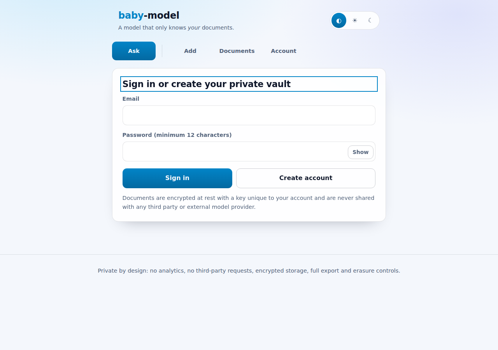
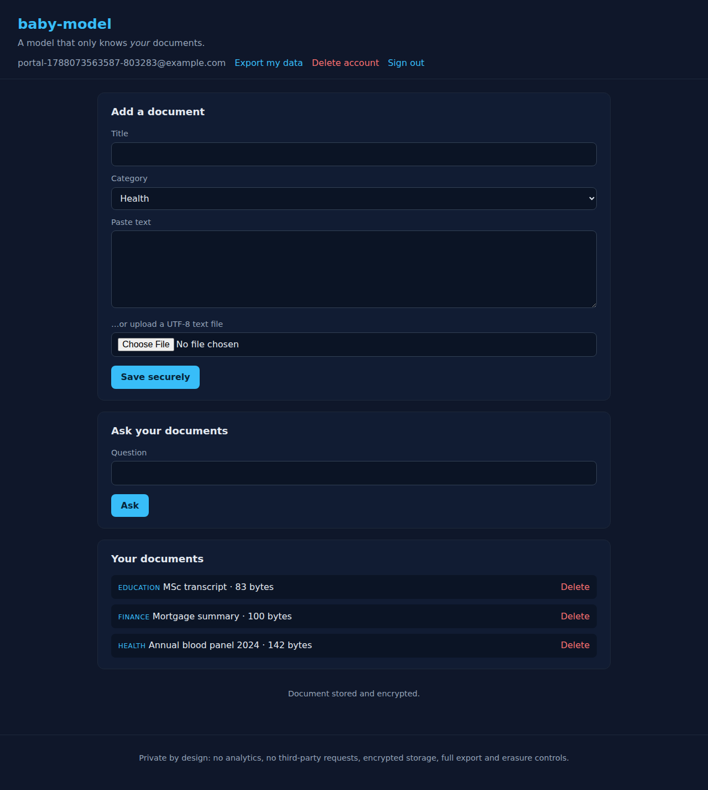
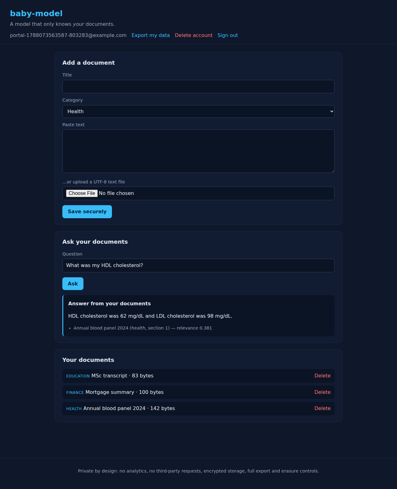
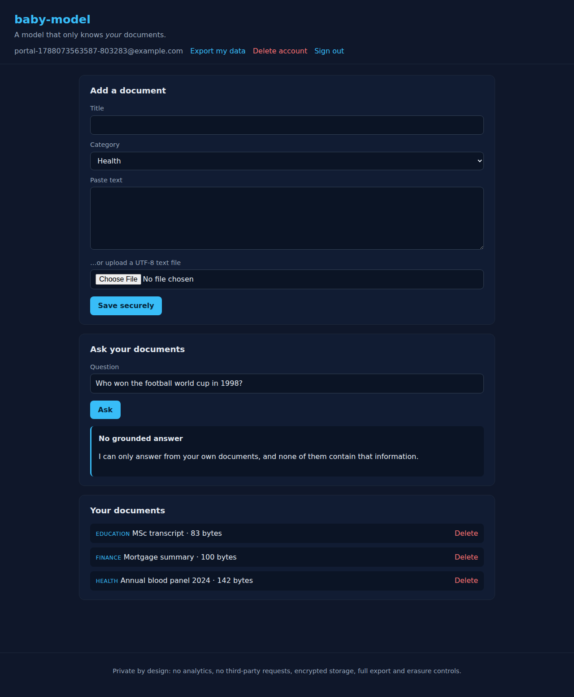
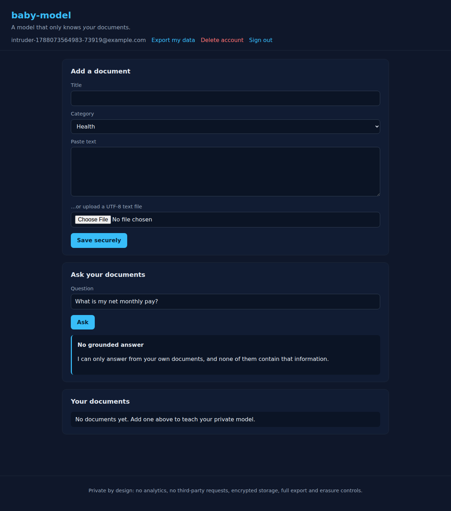
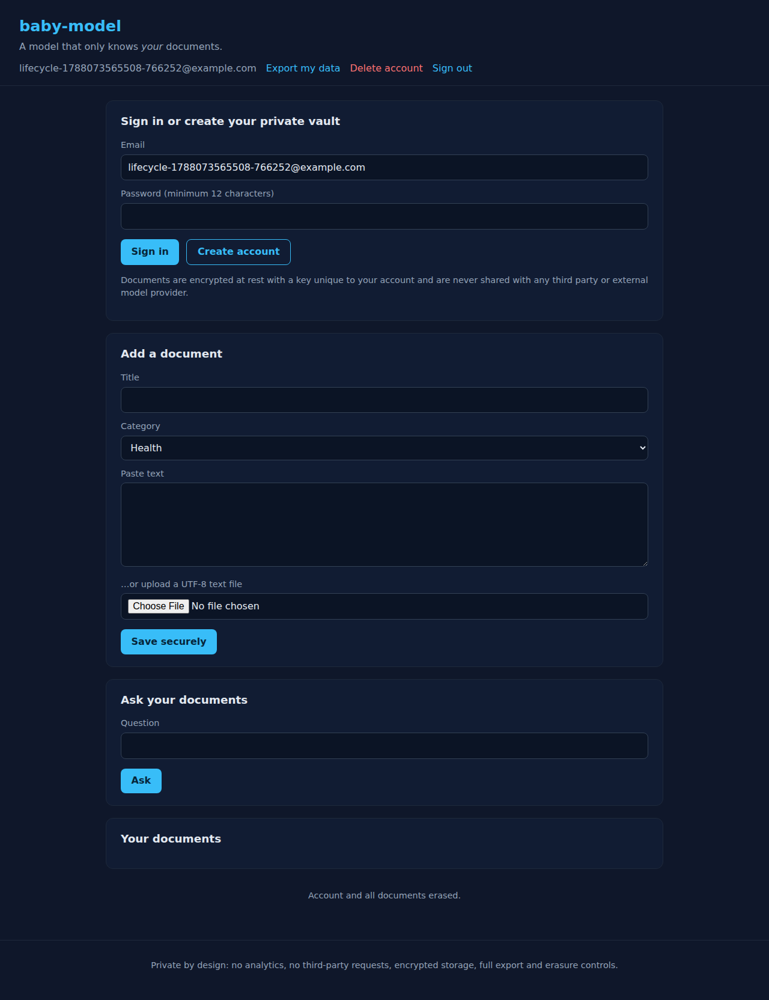

# baby-model

A model that only knows **your** data.

`baby-model` is a self-hosted portal that learns from the documents you give it —
health records, finance statements, professional paperwork, education certificates
and anything else — and answers questions **only** from those documents. Every
answer is extracted verbatim from your own files and cited; when your documents
do not contain the answer, the model says so instead of guessing.

Nothing is sent to any third-party model provider: retrieval, ranking and answer
extraction all run locally inside the application process.

## Screenshots

<!-- screenshots:start -->
### Sign in or create a private, encrypted vault



### Health, finance, professional and education documents stored encrypted



### Answers are extracted from your documents and always cited



### Questions your documents cannot answer are refused instead of guessed



### A second account can neither see nor query another user documents



### One click erases the account and every stored document


<!-- screenshots:end -->

## Features

- **Private document vault** — upload or paste UTF-8 text documents, tagged as
  `health`, `finance`, `professional`, `education` or `other`.
- **Grounded question answering** — TF-IDF retrieval over your own chunks plus
  extractive answering, with citations back to the document and section.
- **Explicit refusals** — if nothing relevant is found, the model answers
  “I can only answer from your own documents…”, never inventing facts.
- **Strict isolation** — every query and document lookup is scoped by the owner's
  user id, so one account can never read another account's data.
- **Data rights built in** — one-click export (portability) and irreversible
  account erasure (right to be forgotten).

## Security and privacy design

| Concern | Control |
| --- | --- |
| Password storage | `scrypt` (N=16384, r=8, p=1) with a per-password random salt |
| Session handling | 256-bit random tokens, only their SHA-256 hash is stored, `HttpOnly` + `SameSite=Strict` (+ `Secure` in production) cookies, server-side expiry and revocation |
| CSRF | Per-session CSRF token required on every state-changing request |
| Encryption at rest | Documents and chunks are encrypted with AES-256-GCM using a per-user data key, which is itself wrapped with the server `MASTER_KEY` |
| Database | SQLite file created with `0600` permissions inside a `0700` data directory |
| Authorisation | Every document, chunk and export query filters on `user_id`; cross-account access returns `404` |
| Transport & headers | `helmet` with a strict CSP (`default-src 'self'`, no framing, no object sources), `Referrer-Policy: no-referrer`, `Cache-Control: no-store` |
| Abuse protection | Global, per-question and per-authentication rate limits, upload size limits, UTF-8 text-only uploads |
| Crawlers & AI scrapers | `robots.txt` disallows every user agent (including `GPTBot`, `Google-Extended`, `ClaudeBot`, `CCBot`, `PerplexityBot` and friends) and every response carries `X-Robots-Tag: noindex, nofollow, noarchive, nosnippet, noimageindex, notranslate, noai, noimageai`. Nothing beyond the sign-in page is reachable without a session anyway |
| Prompt injection | Instruction-like passages, hidden control characters and exfiltration URLs found in stored documents are redacted from answers, excerpts and titles; answers stay extractive and never leave the server |
| Auditability | Append-only `audit_log` of registrations, logins, document changes, questions, exports and erasures (no document content is logged) |
| No third parties | No analytics, no external fonts or CDNs, no outbound model API calls |

### Data-protection compliance notes

- **Data minimisation** — the only personal identifier stored is the email address
  used to sign in; documents are opaque ciphertext at rest.
- **Purpose limitation** — stored content is used solely to answer that user's own
  questions.
- **Right of access & portability** — `GET /api/account/export` returns the full
  account content as JSON.
- **Right to erasure** — `DELETE /api/account` removes the user, documents, chunks
  and sessions, and anonymises the audit trail.
- **No indexing or training** — the portal asks search engines and AI crawlers not
  to index, archive, snippet or train on anything; confidential content is in any
  case only served to an authenticated session over `Cache-Control: no-store`.
- **Key management** — set `MASTER_KEY` (32 bytes, hex) from your secret manager in
  production; the server refuses to start in production without it.

## Architecture

```
web/                 Static portal (no framework, CSP-friendly, no third-party requests)
server/src/app.ts    Express application: auth, documents, question answering
server/src/lib/
  config.ts          Environment configuration and master key loading
  crypto.ts          scrypt password hashing, AES-256-GCM sealing, key wrapping
  db.ts              SQLite schema and hardened file permissions
  store.ts           Owner-scoped data access for users, sessions and documents
  text.ts            Tokenisation, sentence splitting and chunking
  model.ts           TF-IDF retrieval and extractive, cited answering
tests/unit/          Vitest unit and API tests (100% coverage enforced)
tests/e2e/           Playwright end-to-end tests that also produce the screenshots
```

### API

| Method | Endpoint | Description |
| --- | --- | --- |
| `POST` | `/api/auth/register` | Create an account and start a session |
| `POST` | `/api/auth/login` | Sign in |
| `POST` | `/api/auth/logout` | Revoke the current session |
| `GET` | `/api/auth/me` | Current account and CSRF token |
| `GET` | `/api/documents` | List your documents |
| `POST` | `/api/documents` | Add a document (JSON body or file upload) |
| `GET` | `/api/documents/:id` | Read one of your documents |
| `DELETE` | `/api/documents/:id` | Delete one of your documents |
| `POST` | `/api/ask` | Ask a question answered only from your documents |
| `GET` | `/api/account/export` | Export everything stored about you |
| `DELETE` | `/api/account` | Erase your account and all data |

## Getting started

```bash
npm install
npm run dev           # http://localhost:3000
```

Production:

```bash
export MASTER_KEY=$(openssl rand -hex 32)   # store this in your secret manager
export NODE_ENV=production
npm run build && npm start
```

### Configuration

| Variable | Default | Purpose |
| --- | --- | --- |
| `MASTER_KEY` | generated in development | 32-byte hex key wrapping per-user data keys (required in production) |
| `DATA_DIR` | `./data` | Directory for the database and development key |
| `DATABASE_FILE` | `$DATA_DIR/baby-model.db` | SQLite database location |
| `PORT` | `3000` | HTTP port |
| `MAX_UPLOAD_BYTES` | `2097152` | Maximum document size |
| `SESSION_TTL_MS` | `43200000` | Session lifetime |
| `AUTH_RATE_LIMIT` | `20` | Authentication attempts per 15 minutes |

## Testing

```bash
npm run test:coverage   # unit + API tests, 100% coverage thresholds
npm run test:e2e        # Playwright end-to-end tests and screenshots
```

### Coverage

<!-- coverage:start -->
| Metric | Coverage |
| --- | --- |
| statements | 100% |
| branches | 100% |
| functions | 100% |
| lines | 100% |
<!-- coverage:end -->

## Documentation site

`npm run docs:build` refreshes the screenshot gallery and coverage table in this
README and regenerates `docs/index.html`, which CI publishes to GitHub Pages.

## License

[MIT](LICENSE)
