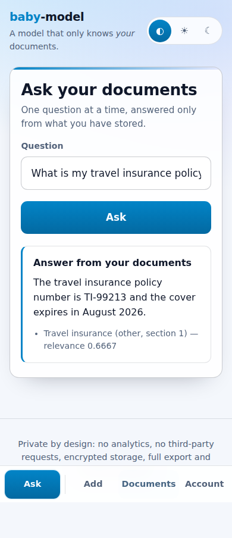
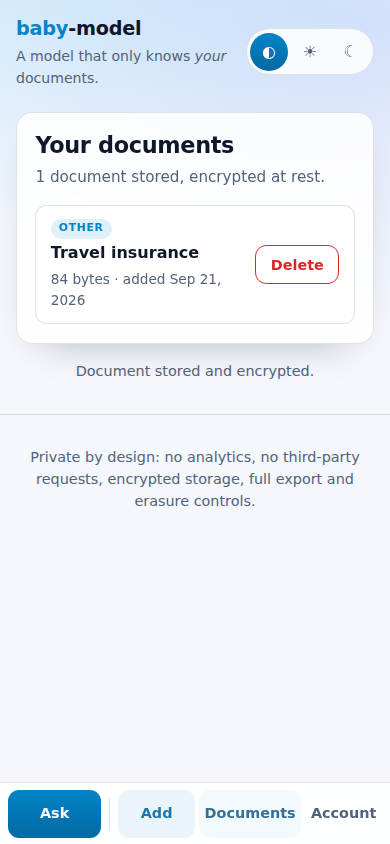
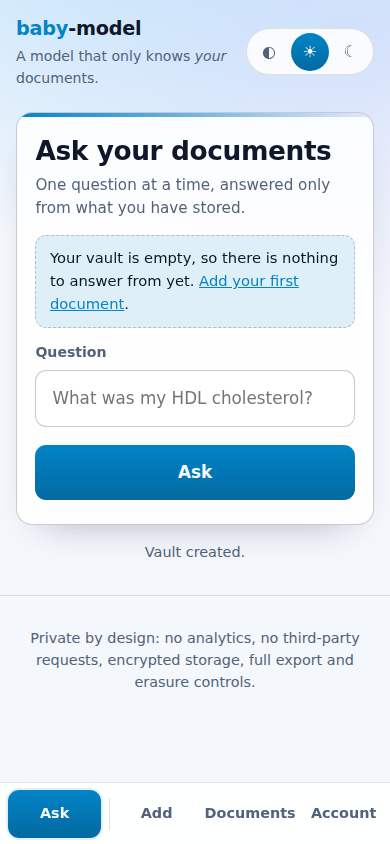
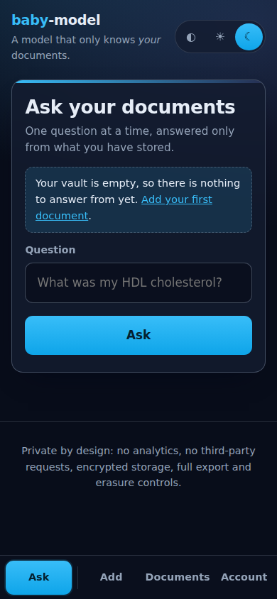
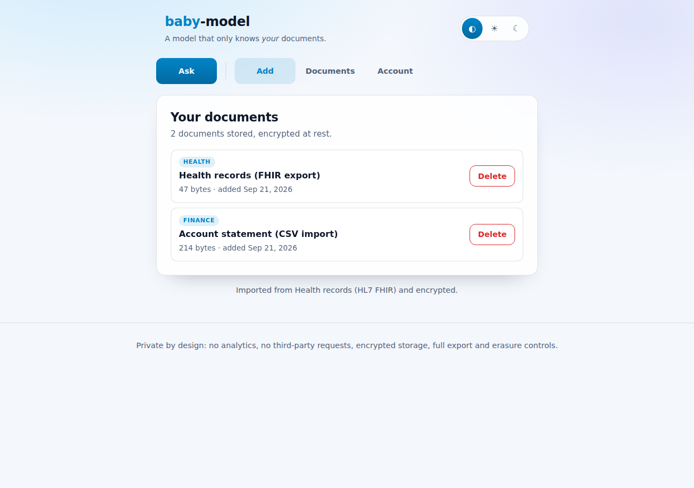
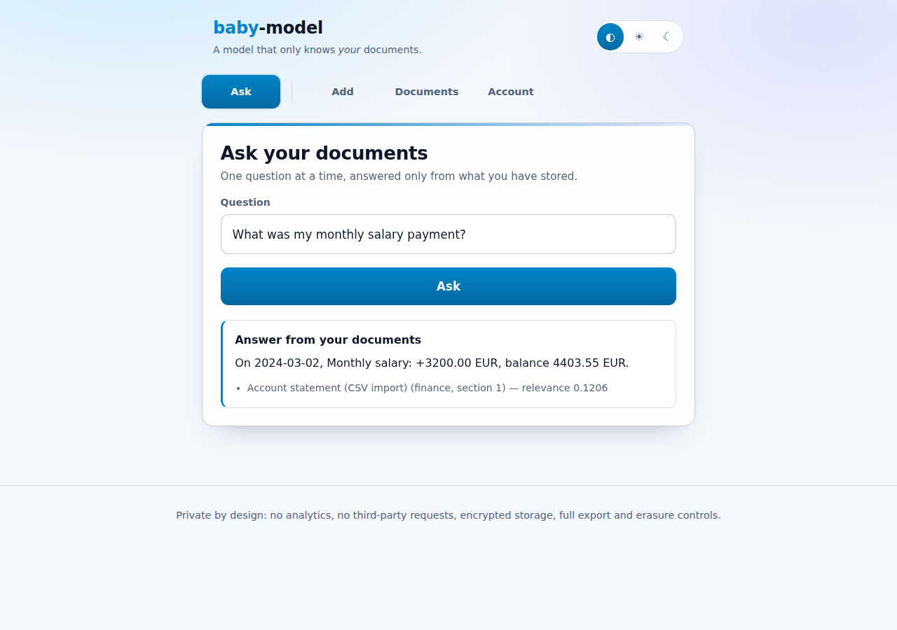
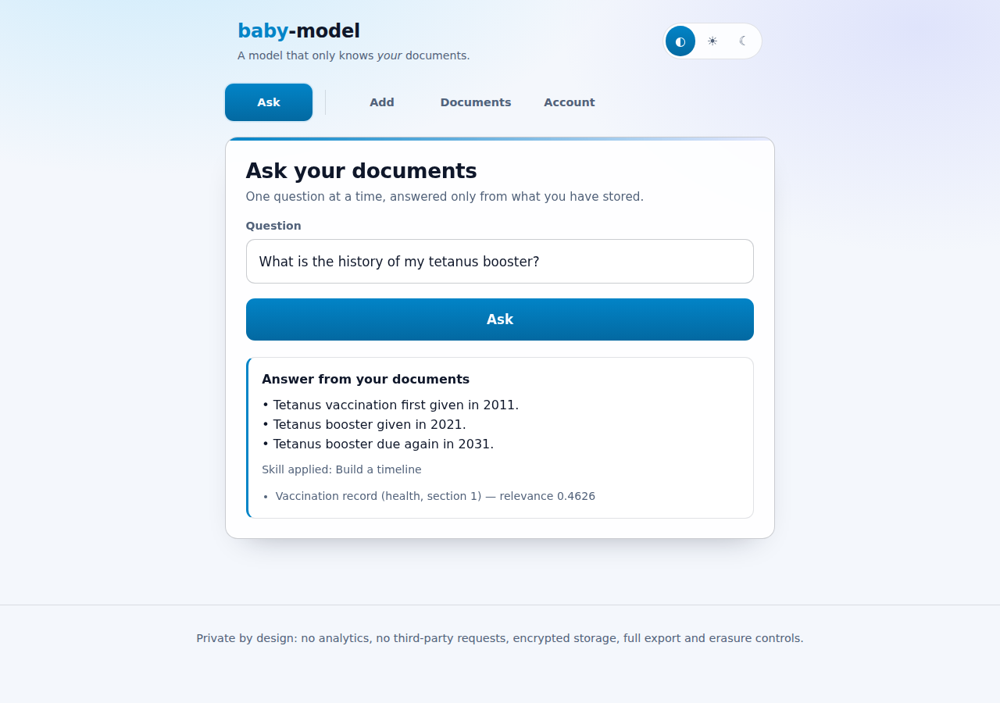

# baby-model

A model that only knows **your** data.

[](https://github.com/charles2ke/baby-model/actions/workflows/ci.yml)
[](https://github.com/charles2ke/baby-model/actions/workflows/docs.yml)

**Website: <https://charles2ke.github.io/baby-model/>**

`baby-model` is a self-hosted portal that learns from the documents you give it —
health records, finance statements, professional paperwork, education certificates
and anything else — and answers questions **only** from those documents. Every
answer is extracted verbatim from your own files and cited; when your documents
do not contain the answer, the model says so instead of guessing.

Nothing is sent to any third-party model provider: retrieval, ranking and answer
extraction all run locally inside the application process.

## Contents

- [Quick start](#quick-start)
- [Try it in two minutes](#try-it-in-two-minutes)
- [How it works](#how-it-works)
- [Features](#features)
- [Screenshots](#screenshots)
- [Security and privacy design](#security-and-privacy-design)
- [Architecture](#architecture)
- [Skills](#skills)
- [Real-world integrations](#real-world-integrations)
- [Configuration](#configuration)
- [Testing](#testing)
- [Troubleshooting](#troubleshooting)
- [Documentation site](#documentation-site)
- [Contributing](#contributing)
- [License](#license)

## Quick start

Requirements: Node.js 20 or newer (CI runs on Node 22) and npm.

```bash
git clone https://github.com/charles2ke/baby-model.git
cd baby-model
npm install
npm run dev           # http://localhost:3000
```

Open <http://localhost:3000>, create an account, add a document on the **Add**
page — paste some text or import a provider export — then ask a question about it
on the **Ask** page. In development a master key is generated for you under
`./data`; in production you must supply your own:

```bash
export MASTER_KEY=$(openssl rand -hex 32)   # store this in your secret manager
export NODE_ENV=production
npm run build && npm start
```

Everything is stored on the machine you run it on: a single SQLite file in
`DATA_DIR` by default, with documents encrypted at rest. See
[Configuration](#configuration) for the environment variables.

## Try it in two minutes

1. Start the server, open <http://localhost:3000> and choose **Create account**
   with any email and a password of at least 12 characters.
2. Go to **Add**, title the document `Annual blood panel 2024`, keep the
   category `Health`, and paste:

   ```text
   Annual blood panel taken on 12 March 2024. HDL cholesterol was 62 mg/dL and
   LDL cholesterol was 98 mg/dL. Blood pressure measured 118 over 76.
   ```

3. Save it, then go to **Ask** and ask `What was my HDL cholesterol?` — the
   answer comes back as the sentence from your own document, cited.
4. Ask `Who won the World Cup in 1998?` — the model refuses, because your
   documents do not say.

## How it works

1. **Add** — a document (pasted text, an uploaded UTF-8 file or a provider
   export converted locally by an [integration](#real-world-integrations)) is
   split into sentences and grouped into overlapping chunks.
2. **Store** — document text and chunks are sealed with AES-256-GCM under a
   per-user data key, which is itself wrapped with the server `MASTER_KEY`, and
   written to SQLite alongside the owner's `user_id`.
3. **Retrieve** — a question is tokenised and ranked against *only* that user's
   chunks with TF-IDF cosine similarity.
4. **Answer** — the best-matching sentences are returned verbatim with citations
   back to the document and section; a [skill](#skills) may reshape them into a
   summary, timeline or list of figures. If nothing relevant is found, the model
   refuses instead of guessing.

No step calls an external service, and no step can read a chunk that belongs to
another account.

## Features

- **Private document vault** — upload or paste UTF-8 text documents, tagged as
  `health`, `finance`, `professional`, `education` or `other`.
- **Real-world imports** — bring in the files the systems that hold your data
  actually produce: HL7 FHIR health exports from a patient portal or Apple
  Health, CSV statements from a bank or card issuer, `.eml` messages from a mail
  client and `.ics` calendar exports. Each file is converted to readable text
  locally, then stored encrypted like any other document.
- **Grounded question answering** — TF-IDF retrieval over your own chunks plus
  extractive answering, with citations back to the document and section.
- **Skills** — reusable, Claude-style skills (a name, a description of when to
  use it and a deterministic procedure) reshape a grounded answer into a
  summary, a timeline or a list of figures when the question calls for it,
  without ever adding anything your documents do not say.
- **One job per page** — asking a question, adding a document, browsing the vault
  and managing the account each get their own page, reached from a tab bar.
- **Feedback on every action** — buttons show their work (`Asking…`, `Saving…`,
  `Deleting…`) and disable themselves while a request is in flight, so a slow
  save is visible and cannot be submitted twice.
- **Guidance when the vault is empty** — the Ask page points a new account at the
  Add page instead of answering nothing, and the Documents page shows how much is
  stored, each item with a readable size and the date it was added.
- **Safe by default** — deleting a document or the account asks first, the
  sign-in password can be revealed while typing it, and a status message is
  cleared when you move to another page rather than following you around.
- **Mobile first** — a thumb-friendly bottom tab bar, full-width controls, large
  tap targets and safe-area padding on phones; the same tabs move to the top on
  larger screens.
- **Light and dark themes** — a switch in the header follows the device theme by
  default and can be pinned to light or dark; the choice is remembered locally
  and applied before the first paint.
- **Explicit refusals** — if nothing relevant is found, the model answers
  “I can only answer from your own documents…”, never inventing facts.
- **Strict isolation** — every query and document lookup is scoped by the owner's
  user id, so one account can never read another account's data.
- **Data rights built in** — one-click export (portability) and irreversible
  account erasure (right to be forgotten).

## Screenshots

<!-- screenshots:start -->
### Sign in or create a private, encrypted vault


### Health, finance, professional and education documents stored encrypted


### Answers are extracted from your documents and always cited


### Questions your documents cannot answer are refused instead of guessed


### A second account can neither see nor query another user documents


### One click erases the account and every stored document


### Asking a question is a page of its own and the primary action on mobile



### Every page does one thing, with a thumb-friendly tab bar on small screens



### A light theme for bright rooms, remembered across visits



### A dark theme, or simply follow the theme of the device



### Bank statements and health records imported straight from provider exports



### Imported real-world data is answerable and cited like any other document



### Skills reshape a grounded answer into a timeline, a summary or a list of figures


<!-- screenshots:end -->

## Security and privacy design

| Concern | Control |
| --- | --- |
| Password storage | `scrypt` (N=16384, r=8, p=1) with a per-password random salt |
| Session handling | 256-bit random tokens, only their SHA-256 hash is stored, `HttpOnly` + `SameSite=Strict` (+ `Secure` in production) cookies, server-side expiry and revocation |
| CSRF | Per-session CSRF token required on every state-changing request |
| Encryption at rest | Documents and chunks are encrypted with AES-256-GCM using a per-user data key, which is itself wrapped with the server `MASTER_KEY` |
| Database | SQLite file created with `0600` permissions inside a `0700` data directory |
| Authorisation | Every document, chunk and export query filters on `user_id`; cross-account access returns `404` |
| Transport & headers | `helmet` with a strict CSP (`default-src 'self'`, no framing, no object sources), `Referrer-Policy: no-referrer`, `Cache-Control: no-store` |
| Abuse protection | Global, per-question and per-authentication rate limits, upload size limits, UTF-8 text-only uploads |
| Crawlers & AI scrapers | `robots.txt` disallows every user agent (including `GPTBot`, `Google-Extended`, `ClaudeBot`, `CCBot`, `PerplexityBot` and friends) and every response carries `X-Robots-Tag: noindex, nofollow, noarchive, nosnippet, noimageindex, notranslate, noai, noimageai`. Nothing beyond the sign-in page is reachable without a session anyway |
| Prompt injection | Instruction-like passages, hidden control characters and exfiltration URLs found in stored documents are redacted from answers, excerpts and titles; answers stay extractive and never leave the server |
| Auditability | Append-only `audit_log` of registrations, logins, document changes, questions, exports and erasures (no document content is logged) |
| No third parties | No analytics, no external fonts or CDNs, no outbound model API calls |

### Data-protection compliance notes

- **Data minimisation** — the only personal identifier stored is the email address
  used to sign in; documents are opaque ciphertext at rest.
- **Purpose limitation** — stored content is used solely to answer that user's own
  questions.
- **Right of access & portability** — `GET /api/account/export` returns the full
  account content as JSON.
- **Right to erasure** — `DELETE /api/account` removes the user, documents, chunks
  and sessions, and anonymises the audit trail.
- **No indexing or training** — the portal asks search engines and AI crawlers not
  to index, archive, snippet or train on anything; confidential content is in any
  case only served to an authenticated session over `Cache-Control: no-store`.
- **Key management** — set `MASTER_KEY` (32 bytes, hex) from your secret manager in
  production; the server refuses to start in production without it.

## Architecture

```
web/                 Static portal: one page per task (#/ask, #/add, #/documents,
                     #/account), mobile first, CSP-friendly, no third-party requests
server/src/app.ts    Express application: auth, documents, question answering
server/src/lib/
  config.ts          Environment configuration and master key loading
  crypto.ts          scrypt password hashing, AES-256-GCM sealing, key wrapping
  db.ts              SQLite schema and hardened file permissions
  store.ts           Owner-scoped data access for users, sessions and documents
  text.ts            Tokenisation, sentence splitting and chunking
  integrations.ts    Real-world connectors: FHIR, bank CSV, email, iCalendar
  skills.ts          Claude-style skills that reshape grounded answers
  model.ts           TF-IDF retrieval and extractive, cited answering
tests/unit/          Vitest unit and API tests (100% coverage enforced)
tests/e2e/           Playwright end-to-end tests that also produce the screenshots
```

### API

| Method | Endpoint | Description |
| --- | --- | --- |
| `POST` | `/api/auth/register` | Create an account and start a session |
| `POST` | `/api/auth/login` | Sign in |
| `POST` | `/api/auth/logout` | Revoke the current session |
| `GET` | `/api/auth/me` | Current account and CSRF token |
| `GET` | `/api/documents` | List your documents |
| `POST` | `/api/documents` | Add a document (JSON body or file upload) |
| `GET` | `/api/documents/:id` | Read one of your documents |
| `DELETE` | `/api/documents/:id` | Delete one of your documents |
| `GET` | `/api/integrations` | List the real-world import connectors |
| `POST` | `/api/integrations/:id/import` | Import a provider export as a document |
| `GET` | `/api/skills` | List the skills the model can apply |
| `POST` | `/api/ask` | Ask a question answered only from your documents |
| `GET` | `/api/account/export` | Export everything stored about you |
| `DELETE` | `/api/account` | Erase your account and all data |

## Skills

Skills follow the shape of [Claude's Agent Skills](https://docs.claude.com/en/docs/agents-and-tools/agent-skills/overview):
each one declares a **name**, a **description** that says when it should be used,
and the procedure itself. Here the procedure is ordinary code running in this
process, and it is only ever handed sentences that were already extracted from
your own documents — so a skill can change how an answer is presented, never
what it claims.

| Skill | Use when the question asks for | Result |
| --- | --- | --- |
| `summarise` | a summary, an overview, a recap or the key points | the matching sentences as bullet points |
| `timeline` | when something happened, a history or the order of events | the dated sentences, oldest first |
| `figures` | amounts, balances, rates, totals or how much something was | the sentences that carry a figure, with the figures listed |

The model picks at most one skill per question, by matching the words of the
question against the skill triggers, and falls back to the plain extractive
answer when no skill applies or the chosen skill has nothing to contribute. The
answer payload names the skill that shaped it, and the portal shows it under the
answer. Citations, refusals and owner scoping are unchanged.

## Real-world integrations

Integrations are **file-based and offline by design**: you export your data from
the provider yourself and hand the file to your vault. The portal never stores a
provider credential, never calls a provider API and never sends your documents
anywhere, so connecting a new source cannot widen the blast radius of an account
takeover at either end.

| Connector | Typical source | File | Stored as |
| --- | --- | --- | --- |
| `fhir` | Patient portal, hospital record, Apple Health, Epic/Cerner export | `.json` FHIR R4 bundle | Observations, conditions, medications, allergies, immunisations, procedures and reports as plain sentences (`health`) |
| `bank-csv` | Bank, credit card or payment account statement | `.csv` | One sentence per transaction plus a totals summary, with dates, descriptions, amounts, currencies and balances (`finance`) |
| `email` | Gmail, Outlook, Apple Mail or any IMAP client | `.eml` | Subject, sender, recipients, date and the decoded text body (`professional`) |
| `icalendar` | Google Calendar, Outlook, Apple Calendar, booking confirmations | `.ics` | One sentence per event with its start, end, location and notes (`professional`) |

Pick the source on the **Add** page, upload the export (or paste it), and adjust
the title and category if the suggested ones do not fit. Files that a connector
cannot read are refused with an explanation instead of being stored, and the
imported text is chunked, encrypted and cited exactly like a pasted document.

## Configuration

| Variable | Default | Purpose |
| --- | --- | --- |
| `MASTER_KEY` | generated in development | 32-byte hex key wrapping per-user data keys (required in production) |
| `DATA_DIR` | `./data` | Directory for the database and development key |
| `DATABASE_FILE` | `$DATA_DIR/baby-model.db` | SQLite database location |
| `PORT` | `3000` | HTTP port |
| `MAX_UPLOAD_BYTES` | `2097152` | Maximum document size |
| `SESSION_TTL_MS` | `43200000` | Session lifetime |
| `AUTH_RATE_LIMIT` | `20` | Authentication attempts per 15 minutes |

## Testing

```bash
npm run test:coverage   # unit + API tests, 100% coverage thresholds
npm run test:e2e        # Playwright end-to-end tests and screenshots
```

The end-to-end run also regenerates the screenshots in `docs/screenshots/`.
Playwright needs its browser once: `npx playwright install --with-deps chromium`.

### What the tests cover

| Suite | What it proves |
| --- | --- |
| `tests/unit` | Crypto, storage, retrieval, skills, integrations and every API route, at 100% coverage |
| `tests/e2e` | Sign-up, adding and importing documents, grounded answers and refusals, account isolation, deletion and erasure, mobile layout, themes and the interaction details above |

### Coverage

<!-- coverage:start -->
| Metric | Coverage |
| --- | --- |
| statements | 100% |
| branches | 100% |
| functions | 100% |
| lines | 100% |
<!-- coverage:end -->

## Troubleshooting

| Symptom | Cause and fix |
| --- | --- |
| `MASTER_KEY environment variable is required in production` on start | Production refuses to run without a key. Set `MASTER_KEY` to 32 bytes of hex, e.g. `openssl rand -hex 32`, from your secret manager |
| `Only UTF-8 text documents are supported` when uploading | The file is binary (PDF, image, Office document). Export or convert it to text first, or use a [connector](#real-world-integrations) for a provider export |
| An import is refused with an explanation | The file does not match the chosen source, e.g. a FHIR bundle that is not valid JSON. Pick the matching source or paste the contents as plain text |
| `Too many attempts, please try again later.` while signing in | The authentication rate limit. Wait, or raise `AUTH_RATE_LIMIT` in development |
| Answers refuse everything | The vault is empty or nothing matched. Add a document with the wording you expect to ask about; the Ask page says so when there is nothing stored |
| `npm run test:e2e` cannot start a browser | Run `npx playwright install --with-deps chromium` once |

## Documentation site

`npm run docs:build` refreshes the screenshot gallery and coverage table in this
README and regenerates `docs/index.html`, which CI publishes to GitHub Pages at
<https://charles2ke.github.io/baby-model/>.

## Contributing

| Script | What it does |
| --- | --- |
| `npm run dev` | Start the server with reload on <http://localhost:3000> |
| `npm run typecheck` | TypeScript check without emitting |
| `npm run build` / `npm start` | Compile to `dist/` and run the compiled server |
| `npm test` / `npm run test:coverage` | Vitest unit and API tests |
| `npm run test:e2e` | Playwright end-to-end tests and screenshots |
| `npm run docs:build` | Refresh the generated README sections and `docs/index.html` |

Before opening a pull request, run `npm run typecheck`, `npm run test:coverage`
and `npm run test:e2e`; CI runs the same steps. The screenshot gallery and the
coverage table above are generated — edit only the text outside the
`<!-- screenshots -->` and `<!-- coverage -->` markers. Security issues should
follow [SECURITY.md](SECURITY.md) rather than a public issue.

## License

[MIT](LICENSE)
